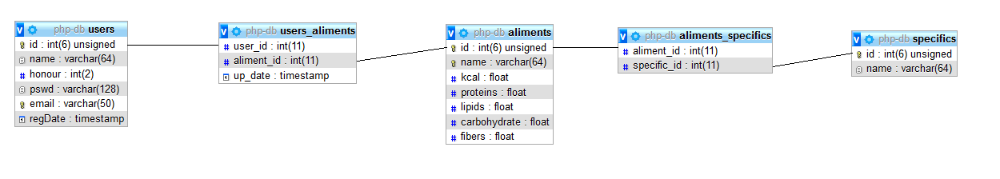
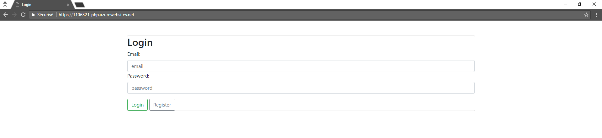
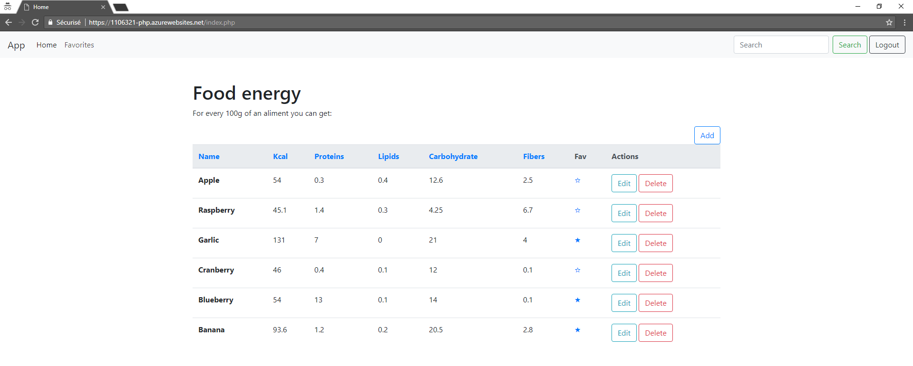
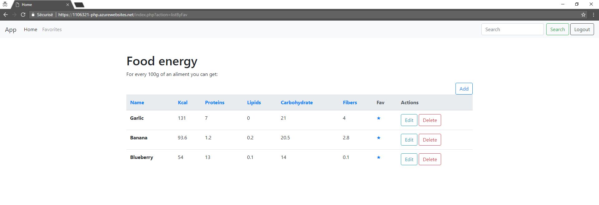
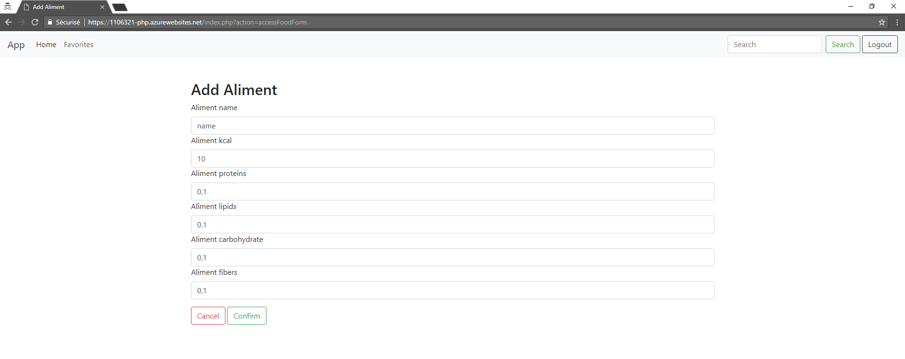
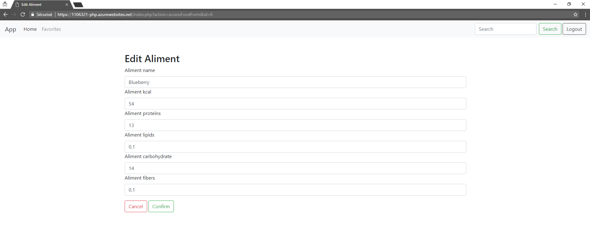

# Project Title

Basic PHP project with MVC Pattern
This project aims to help you list and organise aliments and their nutrition facts

## Getting Started

To add features think about affecting the view, the model, the controller and the router (index.php)

## Deployment

Change database values in sqlScriptCreateTable.php, sqlScriptInsertTestData.php, model/Manager.php

## Built With

* [PHP]
* [Bootstrap 4]
* [JS]

## Database relations view

## App's Screenshots

